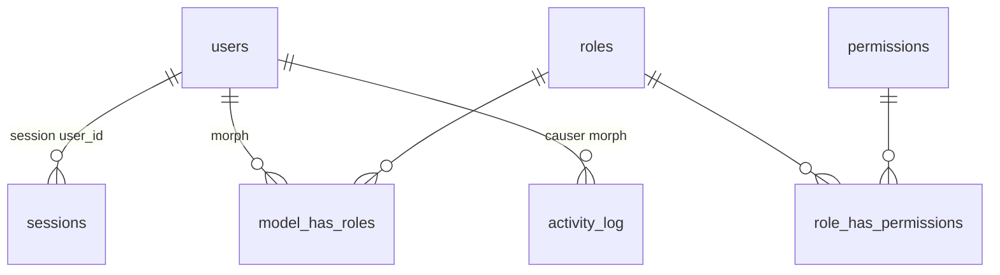

# Phase 2 — Admin auth & RBAC (database schema)

**Analysis:** [p2-admin-auth-rbac-analysis.md](./p2-admin-auth-rbac-analysis.md)  
**Spec:** [phases/p2-admin-auth-rbac.md](../phases/p2-admin-auth-rbac.md)

Schema for Phase 2 only. Business tables (`contact_inquiries`, invoices, CMS) belong to later phases. Package tables follow Spatie defaults unless noted.

**App root:** `site/`  
**Existing migrations:** `0001_01_01_000000_create_users_table.php` (users, password_reset_tokens, sessions).

---

## 1. Entity relationship (logical)



Staff users link to **roles** only (not direct `model_has_permissions` in normal operation). Activity rows optionally reference a causer user.

---

## 2. `users` (alter existing)

Laravel baseline columns already present: `id`, `name`, `email`, `email_verified_at`, `password`, `remember_token`, `created_at`, `updated_at`.

**Migration: add staff columns**

| Column | Type | Default | Notes |
| --- | --- | --- | --- |
| `is_active` | `boolean` | `true` | `false` → login rejected |
| `phone` | `string(50)` nullable | null | Display / future SMS not in scope |
| `job_title` | `string(100)` nullable | null | Display in admin |

**Indexes:** existing unique on `email`. Optional index on `is_active` if user lists filter active/inactive at scale (optional Phase 2).

**Model casts:** `is_active` → boolean; `password` → hashed.

**Not added in Phase 2:** `must_change_password`, `last_login_at` (nice-to-have; defer unless requested).

---

## 3. `sessions` (existing — no structural change)

Already created in `0001_01_01_000000_create_users_table.php`:

| Column | Purpose |
| --- | --- |
| `id` | Session id (cookie) |
| `user_id` | FK to users when authenticated |
| `ip_address`, `user_agent` | Forensics |
| `payload` | Encrypted session data |
| `last_activity` | Unix timestamp; drives `SESSION_LIFETIME` expiry |

**Operational note:** On deactivate or optional “force logout”, delete rows where `user_id = ?`.

**Config (not a column):** `SESSION_LIFETIME=4320` (3 days idle). No refresh-token table.

---

## 4. `password_reset_tokens` (existing — optional feature)

| Column | Purpose |
| --- | --- |
| `email` (PK) | User email |
| `token` | Hashed token |
| `created_at` | Expiry via `config/auth.php` `passwords.users.expire` |

**Phase 2:** unused — staff passwords are set by super admin or changed while logged in via `/api/admin/me/password`. Table remains from Laravel default; no migration changes.

---

## 5. Spatie Permission (`spatie/laravel-permission`)

Publish default migration (`php artisan vendor:publish --provider="Spatie\Permission\PermissionServiceProvider"`). Standard table set:

### 5.1 `permissions`

| Column | Type | Notes |
| --- | --- | --- |
| `id` | bigint PK | |
| `name` | string | Stable key, e.g. `manage-users` |
| `guard_name` | string | Always `web` |
| `created_at`, `updated_at` | timestamps | |

**Unique:** (`name`, `guard_name`).

**Seed data:** all keys from [requirements.md](./requirements.md#roles--permissions-target) via idempotent seeder (`firstOrCreate`).

### 5.2 `roles`

| Column | Type | Notes |
| --- | --- | --- |
| `id` | bigint PK | |
| `name` | string | `super_admin` or Enovak-defined e.g. `admin`, `sales` |
| `guard_name` | string | `web` |
| `created_at`, `updated_at` | timestamps | |

**Unique:** (`name`, `guard_name`).

**Seed:** one row `name = super_admin` only. Other roles created via admin API.

**Reserved names (app-level):** treat `super_admin` as system role — no delete/rename.

### 5.3 `role_has_permissions`

| Column | Type |
| --- | --- |
| `permission_id` | FK → permissions.id (cascade delete) |
| `role_id` | FK → roles.id (cascade delete) |

**Primary key:** (`permission_id`, `role_id`).

**Seed:** link **every** permission id to `super_admin` role id.

### 5.4 `model_has_roles`

| Column | Type | Notes |
| --- | --- | --- |
| `role_id` | FK → roles.id | |
| `model_type` | string | `App\Models\User` |
| `model_id` | bigint | `users.id` |

**Primary key:** (`role_id`, `model_id`, `model_type`).

**Seed:** assign `super_admin` role **only** to the one seeded super admin user. Application must reject assigning this role to any other user (no extra DB column required — enforce in app).

### 5.5 `model_has_permissions` (empty in normal ops)

Same shape as package default. **Do not** seed staff direct permissions. Table exists for Spatie completeness; Phase 2 UI does not expose direct user permissions.

### 5.6 `config/permission.php`

- `teams` → `false`
- `column_names` → package defaults
- Clear permission cache after seed (`php artisan permission:cache-reset` or `$registrar->forgetCachedPermissions()` in seeder)

---

## 6. Spatie Activitylog (`spatie/laravel-activitylog`)

Publish migration. Typical `activity_log` table:

| Column | Type | Notes |
| --- | --- | --- |
| `id` | bigint PK | |
| `log_name` | string nullable | Index; values `auth`, `user`, `role`, `system`, … |
| `description` | text | Human-readable feed line |
| `subject_type`, `subject_id` | morph nullable | e.g. User, Role |
| `causer_type`, `causer_id` | morph nullable | Actor user; null on failed login |
| `event` | string nullable | Package optional field |
| `properties` | json nullable | `{ ip, user_agent, target_user_id, permission_names, … }` |
| `batch_uuid` | uuid nullable | Optional grouped actions |
| `created_at`, `updated_at` | timestamps | |

**Indexes:** (`log_name`), (`causer_id`, `causer_type`), (`created_at`) — follow published migration (Spatie adds sensible indexes).

**Not stored in business tables:** audit is append-only here for Phase 2 scope.

---

## 7. Sanctum (no extra tables for SPA auth)

`composer require laravel/sanctum` — for SPA, **session + CSRF** is used. Personal access token table (`personal_access_tokens`) is created by Sanctum migration but **unused** for admin login if you do not issue tokens.

Optional: skip creating PATs entirely in code; migration harmless.

---

## 8. Seed summary (single source of truth)

| Table | Rows after seed |
| --- | --- |
| `permissions` | Full catalog (~20 keys) |
| `roles` | 1 × `super_admin` |
| `role_has_permissions` | `super_admin` × all permissions |
| `users` | 1 × super admin (env-driven email/password) |
| `model_has_roles` | Super admin user → `super_admin` role |
| `model_has_permissions` | Empty |
| `activity_log` | Empty |

**Not seeded:** `admin` role, custom roles, additional users.

---

## 9. Migration order (recommended)

| Order | Migration |
| --- | --- |
| 1 | Existing Laravel users/sessions/password_reset_tokens (done) |
| 2 | `add_staff_fields_to_users_table` |
| 3 | Spatie permission tables (vendor publish) |
| 4 | Spatie activity_log table (vendor publish) |
| 5 | Sanctum (if not already bundled in Laravel 12 install) |

Run: `php artisan migrate` then `RolePermissionSeeder` + `SuperAdminSeeder` (names illustrative).

---

## 10. Permission catalog (seed rows)

Exact `permissions.name` values to insert (`guard_name = web`):

```
manage-users
manage-roles
view-activity-log
view-contact-inquiries
manage-contact-inquiries
manage-invoice-clients
create-invoice
edit-invoice
send-invoice
delete-invoice-draft
view-all-invoices
view-own-invoices
manage-company-settings
manage-services
manage-products
manage-showcase
manage-client-logos
manage-media
```

Group labels are UI-only (map in React); DB stores flat names.

---

## 11. Future tables (not Phase 2)

Do **not** create in Phase 2 migrations:

- `contact_inquiries` (Phase 3)
- `invoice_clients`, `invoices`, `invoice_line_items`, sequences (Phase 4)
- CMS content tables (Phase 5)

Phase 2 only ensures permission **rows** exist so role matrix stays stable when those tables arrive.

---

## 12. Environment variables (schema-related)

| Variable | Example | Purpose |
| --- | --- | --- |
| `DB_*` | MySQL connection | Sessions + all tables |
| `SESSION_DRIVER` | `database` | Session persistence |
| `SESSION_LIFETIME` | `4320` | 3-day idle session |
| `SUPER_ADMIN_EMAIL` | `admin@enovak.example` | Seeder |
| `SUPER_ADMIN_PASSWORD` | (secret) | Seeder; rotate after first login |
| `SUPER_ADMIN_NAME` | optional | Display name default |

Store secrets in deployment env, not in repo.
